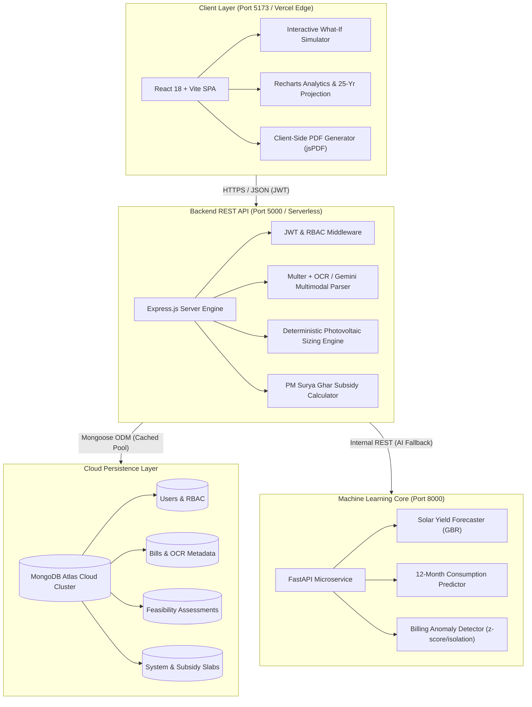

# ☀️ SolarSense AI — Intelligent Solar Energy Recommendation & Cost Optimization Platform

<div align="center">

[](https://reactjs.org/)
[](https://nodejs.org/)
[](https://fastapi.tiangolo.com/)
[](https://www.mongodb.com/atlas)
[](https://tailwindcss.com/)
[](https://ai.google.dev/)
[](https://vercel.com/)
[](LICENSE)

<p align="center">
  <b>An enterprise-grade climate-tech platform empowering consumers across India to simulate rooftop solar feasibility, calculate PM Surya Ghar subsidies, forecast energy yields via Machine Learning, and project 25-year financial returns.</b>
</p>

[Key Features](#-key-features--capabilities) •
[Architecture](#-system-architecture) •
[Tech Stack](#-technology-stack) •
[Quick Start](#-quick-start--installation) •
[Deployment Guide](#-cloud-deployment-guide) •
[Engineering Formulas](#-mathematical-engineering-formulas) •
[API Reference](#-api-reference)

</div>

---

## 📖 Executive Summary

Accelerating rooftop solar adoption across emerging economies requires solving two major bottlenecks: **opaque technical sizing** and **complex government subsidy schemes**. 

**SolarSense AI** bridges this information asymmetry for Indian electricity consumers across four distinct sectors:
- 🏡 **Residential Consumers** (optimizing for slab tariffs, PM Surya Ghar DBT subsidies up to ₹78,000, and net-metering).
- 🌾 **Agricultural & Farms** (aligning day-time irrigation pumping curves with peak solar generation).
- 🏪 **Small Businesses & Retail** (maximizing daytime commercial self-consumption up to 90%).
- 🏭 **Commercial & Industrial (C&I)** (factoring accelerated depreciation, peak demand mitigation, and corporate ESG compliance).

The platform couples **deterministic photovoltaic physics**, **Machine Learning forecasting models (Gradient Boosting & Time-Series)**, and **Google Gemini Multimodal AI** with a high-performance modern web interface.

---

## ⚡ Key Features & Capabilities

### 1. 🎛️ Interactive What-If Solar Simulator
- **Continuous Capacity Sizing:** Adjust capacity freely from **1.0 kW to 15.0 kW** via an interactive slider or instant preset chips (**1, 2, 3, 5, 7, 10 kW**).
- **Reactive Instant Recalculation:** Calculates annual generation (kWh), capital outlay, PM Surya Ghar central subsidy, net payback period, and monthly bill reduction in real time.
- **Recommended vs. What-If Comparison:** Side-by-side trade-off matrix highlighting differences in roof area utilization, upfront cost, and self-sufficiency.
- **Transparent Engineering Parameters:** Expandable drawer displaying underlying assumptions: Peak Sun Hours (4.8 PSH), system derate/performance ratio (78%), and module degradation rates (0.5%/year).

### 2. 📄 Intelligent Bill Diagnostic & Ingestion Engine
- **Multiformat Bill Upload:** Direct ingestion of PDF, PNG, JPG, and WebP electricity bills issued by Indian DISCOMs (MSEDCL, BESCOM, Tata Power, Adani Electricity, UPPCL, TANGEDCO, etc.).
- **Hybrid Extraction Pipeline:** Combines deterministic text parsing (`pdf-parse`), local Optical Character Recognition (`Tesseract.js`), and fallback to **Google Gemini Multimodal AI** for complex scanned bills.
- **Security & Integrity:** File magic bytes validation preventing malicious file uploads masquerading as PDFs/images.
- **Anomaly Detection:** Machine learning z-score and statistical variance flagging unseasonal spikes, meter roll-overs, and abnormal billing surges.

### 3. 📊 5-Tier Comparative Optimization Matrix
SolarSense AI avoids one-size-fits-all recommendations by generating 5 tailored sizing tiers:
1. **Conservative / Budget-Optimized:** Minimum capital expenditure targeting essential base loads.
2. **Balanced / Recommended:** Optimized for maximum tariff offset and fastest financial payback.
3. **High-Offset / Net-Zero Target:** Covers 95–100% of daytime electricity consumption.
4. **Future-Proof / EV-Ready:** Oversized by 25–40% to account for future electric vehicle charging or heat pump additions.
5. **Maximum Roof Capacity:** Physical ceiling based on net usable shadow-free rooftop area.

### 4. 🏢 Tier-1 Solar Manufacturers & EPC Directory
- **ALMM-Compliant Brands:** Pre-populated profiles for premier manufacturers and installers (Tata Power Solar, Waaree Energies, Adani Solar, Premier Energies, Vikram Solar, Loom Solar).
- **Multi-Parameter Comparison:** Compare cell technologies (Mono PERC vs. TOPCon vs. Bifacial), degradation warranties (25–30 years), turnkey price per kW, and inverter efficiencies.
- **Smart Scoring & Badging:** Independent engineering scoring based on efficiency, tier ranking, and regional support.

### 5. 🤖 Grounded AI Solar Advisor (`/chat`)
- Conversational assistant powered by **Google Gemini 2.5 Flash**.
- Domain-restricted prompt engineering to address net-metering policies, DISCOM application procedures, string vs. microinverter trade-offs, battery backup sizing, and maintenance best practices.

### 6. 📑 Instant Audit Report Generation
- Client-side instantaneous PDF export generated via `jsPDF` and `html2canvas`.
- Generates executive-ready feasibility reports including 25-year cash-flow charts, CO₂ emission offsets, tree plantation equivalencies, and engineering disclaimers.

### 7. 🛡️ Enterprise Administration Portal (`/admin`)
- Role-based governance protecting sensitive financial and configuration parameters.
- Platform analytics: total onboarded users, total kW evaluated, estimated lifetime carbon offsets.
- Dynamic control over base cost/kW, regional irradiation factors, and central subsidy tiers without code redeployments.

---

## 🏛 System Architecture



---

## ⚡ Technology Stack

| Layer | Technologies | Purpose |
| :--- | :--- | :--- |
| **Frontend** | React 18, Vite 6, Tailwind CSS 3 | Ultra-fast responsive user interface |
| **Routing & State** | React Router v6, Context API | Client-side routing, Auth & Admin state |
| **Visualization** | Recharts, Lucide React | Interactive payback, cashflow & solar generation charts |
| **Document Export**| jsPDF, html2canvas | Instant client-side PDF solar audit reports |
| **Backend REST** | Node.js (v20+), Express.js | Core business logic, sizing math, and API routes |
| **Database** | MongoDB Atlas / Mongoose 8 | Managed cloud NoSQL database with connection caching |
| **ML Microservice**| Python 3.10+, FastAPI, Uvicorn | Consumption forecasting, yield prediction, and anomaly detection |
| **Machine Learning**| scikit-learn, NumPy, SciPy | Gradient Boosting Regressors, polynomial feature pipelines |
| **OCR & AI Ingestion**| Tesseract.js, pdf-parse, Google Gemini | Multimodal bill extraction & conversational solar advisory |
| **Security & Auth** | JWT, bcryptjs, Helmet, Rate Limiting | Industrial-strength defense against brute-force & abuse |

---

## 📂 Project Directory Structure

```text
SolarSense AI/
├── package.json                   # Root monorepo workspace & start scripts
├── vercel.json                    # Vercel deployment routing & serverless rules
├── README.md                      # Comprehensive project documentation
│
├── client/                        # React 18 + Vite Frontend Application
│   ├── index.html                 # HTML5 document shell & SEO meta tags
│   ├── vite.config.js             # Vite configuration & dev server proxy
│   ├── tailwind.config.js         # Design tokens, color palette, typography
│   └── src/
│       ├── App.jsx                # Route definitions & RBAC guards
│       ├── context/               # AuthContext & AdminAuthContext
│       ├── services/              # API clients (auth, bill, solar, company, chat)
│       ├── utils/
│       │   ├── solarSimulatorEngine.js # Zero-lag What-If mathematical model
│       │   ├── formatters.js      # Indian Rupee (₹) & kW/kWh numeric formatters
│       │   └── pdfExport.js       # PDF audit report generator
│       ├── components/            # Reusable UI component library
│       └── pages/                 # Public, User Portal, and Admin Workspace views
│
├── server/                        # Node.js + Express REST Backend
│   ├── server.js                  # Express bootstrap, CORS, & security headers
│   ├── config/
│   │   ├── db.js                  # MongoDB Atlas connection with serverless pool caching
│   │   └── constants.js           # Physical solar constants, DISCOM rates, subsidy tiers
│   ├── models/                    # Mongoose Schemas (User, Bill, SolarAssessment, Report, etc.)
│   ├── middleware/                # JWT verification, Admin guard, Multer file upload
│   ├── controllers/               # Route logic (Auth, Bills, Feasibility, Admin)
│   ├── routes/                    # Express REST route declarations
│   ├── ai/                        # AI orchestrator & Gemini API integration
│   ├── utils/                     # Solar calculations & heuristic bill parser
│   └── seed/                      # Initializer script for Admin, Demo Accounts & Slabs
│
└── ml-service/                    # Python FastAPI Machine Learning Microservice
    ├── app.py                     # FastAPI server & route handlers
    ├── requirements.txt           # Python dependency specifications
    ├── inference/predictor.py     # Pre-trained model loading & inference pipeline
    ├── training/train_models.py   # Model training & synthetic data pipelines
    └── models/                    # Serialized model binaries (.pkl / .json)
```

---

## 🚀 Quick Start & Installation

### Prerequisites
- **Node.js**: v18.0.0 or higher (`node -v`)
- **Python**: v3.10 or higher (`python --version`)
- **MongoDB**: Active MongoDB Atlas cluster or local instance (`mongodb://127.0.0.1:27017`)

---

### 1. Clone & Configure Environment

Clone the repository and prepare your environment files:

#### Backend Environment (`server/.env`)
```env
PORT=5000
NODE_ENV=development
MONGODB_URI=mongodb+srv://<username>:<password>@cluster0.xxxx.mongodb.net/solarsense_ai?retryWrites=true&w=majority
JWT_SECRET=solarsense_super_secret_jwt_key_2026_btech_project
ADMIN_REGISTRATION_SECRET=solar_admin_secret_passphrase_2026
AI_SERVICE_URL=http://127.0.0.1:8000
GEMINI_API_KEY=your_google_gemini_api_key
GEMINI_MODEL=gemini-2.5-flash
```

#### Frontend Environment (`client/.env`)
```env
VITE_GOOGLE_CLIENT_ID=your_optional_google_oauth_client_id
```

---

### 2. Install Dependencies & Seed Database

```bash
# 1. Install root dependencies
npm install

# 2. Install server dependencies & seed MongoDB
cd server
npm install
npm run seed

# 3. Install client dependencies
cd ../client
npm install
```

---

### 3. Launch Services

You can launch all services using the root scripts:

| Service | Command | URL |
| :--- | :--- | :--- |
| **Express Backend** | `npm run server` | `http://localhost:5000` |
| **React Frontend** | `npm run client` | `http://localhost:5173` |
| **Python ML Service** | `npm run ml` | `http://localhost:8000` |

Once started, navigate to **`http://localhost:5173`** in your browser.

---

## 🔑 Pre-Seeded Demo Credentials

The database comes pre-seeded with test accounts representing real-world consumer profiles:

| Role | Email | Password | Baseline Profile |
| :--- | :--- | :--- | :--- |
| **System Admin** | `admin@solarsense.ai` | `Admin@12345` | Complete administrative authority |
| **Residential User** | `rahul.residential@solarsense.ai` | `User@12345` | 380 kWh/mo, 650 sq ft roof, Slab tariff |
| **Agricultural / Farm** | `ramesh.farm@solarsense.ai` | `User@12345` | 1,850 kWh/mo, 3,500 sq ft, Day irrigation |
| **Small Business** | `priya.business@solarsense.ai` | `User@12345` | 1,250 kWh/mo, 1,400 sq ft, 90% daytime load |
| **Commercial & Industrial** | `arjun.commercial@solarsense.ai` | `User@12345` | 16,500 kWh/mo, 18,000 sq ft, HT tariff |

---

## 🌐 Cloud Deployment Guide

### Deploying to Vercel (Monorepo Setup)

SolarSense AI is pre-configured for seamless deployment to **Vercel**:

1. **Push your repository** to GitHub.
2. In [Vercel Dashboard](https://vercel.com), click **Add New Project** and select your repo.
3. Configure the following **Environment Variables** in Vercel:

```env
NODE_ENV=production
MONGODB_URI=mongodb+srv://<user>:<password>@cluster0.xxxx.mongodb.net/solarsense_ai?retryWrites=true&w=majority
JWT_SECRET=your_production_secret
ADMIN_REGISTRATION_SECRET=your_admin_secret
GEMINI_API_KEY=your_gemini_api_key
GEMINI_MODEL=gemini-2.5-flash
```

4. Click **Deploy**. Vercel will build the Vite frontend into static edge assets and mount the Express API as a serverless backend function.

> [!TIP]
> **Zero-Configuration Fallback:** If the Python ML microservice is not deployed separately to Render or Railway, SolarSense AI's built-in calculation engine seamlessly handles all solar sizing, PM Surya Ghar subsidy tiers, and 25-year cash-flow forecasting in Node.js.

---

## 🧮 Mathematical Engineering Formulas

All engineering and financial equations implemented in the platform comply with **MNRE (Ministry of New and Renewable Energy)** standards:

### 1. Daily Average Electricity Consumption
$$\text{Daily Consumption } (E_{\text{daily}}) = \frac{\text{Monthly Consumption (kWh)}}{30}$$

### 2. Photovoltaic Capacity Requirement (kWp)
$$P_{\text{system}} = \frac{E_{\text{daily}}}{\text{PSH} \times \text{PR}}$$
*Where $\text{PSH} = 4.8\text{ hours/day}$ (Indian national average) and $\text{PR} = 0.78$ (Performance Ratio accounting for inverter clipping, cabling, soiling, and temperature derating).*

### 3. Expected Annual Generation (kWh)
$$E_{\text{annual}} = P_{\text{system}} \times \text{PSH} \times 365 \times \text{PR}$$

### 4. PM Surya Ghar: Muft Bijli Yojana Central Subsidy
$$\text{Subsidy (₹)} = \begin{cases} 
P_{\text{system}} \times ₹30,000 & \text{for } P \le 1\text{ kW} \\
₹60,000 & \text{for } 1 < P \le 2\text{ kW} \\
₹78,000 & \text{for } P \ge 3\text{ kW} \\
₹0 & \text{for Commercial, Industrial \& Non-Residential}
\end{cases}$$

### 5. Net Capital Investment
$$\text{Net Investment (₹)} = (P_{\text{system}} \times \text{Turnkey Cost/kW}) - \text{Subsidy (₹)}$$

### 6. Simple Payback Period
$$\text{Payback (Years)} = \frac{\text{Net Capital Investment (₹)}}{\text{Annual Tariff Savings (₹)}}$$

### 7. Physical Rooftop Space Sizing
$$\text{Area Required (sq ft)} = P_{\text{system}} \times 85\text{ sq ft/kW}$$
$$\text{Panel Count (540W Mono PERC)} = \left\lceil \frac{P_{\text{system}} \times 1000}{540\text{ W}} \right\rceil$$

### 8. Lifetime Environmental Carbon Offset
$$\text{Annual }\text{CO}_2\text{ Mitigated (kg)} = E_{\text{annual}} \times 0.82\text{ kg CO}_2/\text{kWh}$$
$$\text{Tree Plantation Equivalent} = \left\lfloor \frac{\text{Lifetime }\text{CO}_2\text{ Mitigated}}{20\text{ kg CO}_2/\text{tree/yr}} \right\rfloor$$

---

## 📡 API Reference

### Express REST API (`http://localhost:5000/api`)

#### Authentication & User Management
| Method | Endpoint | Description | Protection |
| :--- | :--- | :--- | :--- |
| `POST` | `/api/auth/register` | Register new consumer account | Public |
| `POST` | `/api/auth/login` | Authenticate user and issue JWT | Public |
| `GET` | `/api/auth/me` | Retrieve authenticated profile | Bearer JWT |
| `PUT` | `/api/users/profile` | Update profile, location & tariff details | Bearer JWT |

#### Electricity Bill Diagnostics
| Method | Endpoint | Description | Protection |
| :--- | :--- | :--- | :--- |
| `POST` | `/api/bills/upload` | Ingest bill file (PDF, PNG, JPG) via OCR/Gemini | Bearer JWT |
| `POST` | `/api/bills/manual` | Manually log bill consumption figures | Bearer JWT |
| `GET` | `/api/bills` | Fetch user's historical electricity bills | Bearer JWT |
| `GET` | `/api/bills/:id` | Detailed bill analytics & anomaly insights | Bearer JWT |
| `DELETE`| `/api/bills/:id` | Remove bill record | Bearer JWT |

#### Solar Feasibility & Recommendations
| Method | Endpoint | Description | Protection |
| :--- | :--- | :--- | :--- |
| `POST` | `/api/solar/assess` | Compute sizing metrics & financial projections | Bearer JWT |
| `GET` | `/api/solar/recommendation` | Fetch 5-tier comparative recommendation matrix | Bearer JWT |
| `GET` | `/api/solar/savings-projection`| 25-year cumulative financial cash-flow analysis | Bearer JWT |

#### Solar Companies & EPC Directory
| Method | Endpoint | Description | Protection |
| :--- | :--- | :--- | :--- |
| `GET` | `/api/companies` | List verified ALMM solar manufacturers | Public / Auth |
| `GET` | `/api/companies/compare?ids=x,y` | Multi-parameter side-by-side comparison | Public / Auth |
| `GET` | `/api/companies/:id` | Detailed manufacturer specifications & ratings | Public / Auth |

#### AI Solar Advisor & Administration
| Method | Endpoint | Description | Protection |
| :--- | :--- | :--- | :--- |
| `POST` | `/api/chat/message` | Submit query to Gemini AI Solar Advisor | Bearer JWT |
| `POST` | `/api/admin/login` | Administrator authentication | Public |
| `GET` | `/api/admin/stats` | Platform aggregates (users, capacity, offsets) | Admin JWT |
| `GET` | `/api/admin/users` | User management & audit directory | Admin JWT |
| `GET` | `/api/admin/settings`| System constants & subsidy slab configuration | Admin JWT |
| `PUT` | `/api/admin/settings`| Update live subsidy limits and pricing constants| Admin JWT |

---

## 🔒 Role-Based Access Control (RBAC)

| User Role | Portal | Accessible Routes | Middleware Guard |
| :--- | :--- | :--- | :--- |
| **Guest / Public** | `/` | Landing, How It Works, Solutions, Subsidies, About, Login, Register | None |
| **Consumer (User)**| `/login` | Dashboard, Onboarding, Bill Analysis, Sizing, What-If Simulator, EPCs, Chat, Reports | `protect` (JWT) |
| **System Admin** | `/admin/login` | Admin Dashboard, User Governance, Report Audits, Analytics, Slabs & Settings | `protect` + `adminProtect` |

---

## ⚖ Engineering & Regulatory Disclaimer

> [!IMPORTANT]
> System capacities, solar yields, financial payback estimations, and PM Surya Ghar subsidy amounts presented by **SolarSense AI** are computed via mathematical models and historical meteorological averages. Exact system design, shadow losses, and grid interconnectivity require an on-site physical engineering survey and DISCOM net-metering feasibility clearance.

---

## 👨‍💻 Project Authors & Acknowledgements

Developed as an end-to-end **B.Tech Computer Engineering Capstone Project**.

- **Sahil Khot** & The SolarSense AI Engineering Team
- Dedicated to accelerating clean energy adoption, open climate technology, and India's rooftop solar mission.

For inquiries, support, or contributions, feel free to open an issue or pull request.
